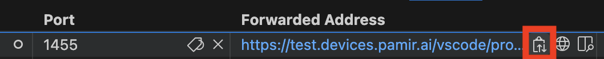

# Distiller Quickstart Guide

This page walks you through connecting Claude, Cursor, and OpenAI Codex to your Distiller device, then points you to ESP32 tutorials and minimal SDK examples.

> ⚠️ **Privacy Notice (Claude Free Trial):**  
> Our complimentary Claude Code subscription routes requests through our account, which means your prompts may be visible to us. You can disable the proxy at any time in **Settings**.

---

## 1) Connect AI Services

### Claude (Claude Code CLI)

1. Toggle the Claude proxy on/off in Settings.   
   

2. Log in from the terminal:
   ```bash
   # If your CLI is named "claude"
   claude /login
   ```

Follow the prompts to complete authentication.

---

### OpenAI Codex (Headless Login Workaround)

Known issue: [https://github.com/openai/codex/issues/2798](https://github.com/openai/codex/issues/2798)

**Option 1 — Copy existing auth from your computer**

> Replace `DEVICE_IP` with your device’s IP. Default password is `one`.

```bash
# Run on your own computer (not on the device)
ssh distiller@DEVICE_IP 'mkdir -p ~/.codex'   # password: one
scp ~/.codex/auth.json distiller@DEVICE_IP:~/.codex/auth.json
```

**Option 2 — Login via Distiller Web UI with port forwarding**

1. In the Distiller Web UI, click **Add Port**, enter `1455`, then press **Enter**.
   

2. Start the normal Codex login flow. When redirected to:

   * `http://localhost:1455/auth/*`
   * `http://localhost:1455/success/*`

   Replace `localhost:1455` with the forwarded address shown in your Ports table.
   

   Continue the flow as usual.

---

### Cursor Agent

Cursor Agent is optional; you can try it and tell us what you’d like automated:

```bash
cursor-agent
```

---

## 2) ESP32 Tutorials

Navigate to the sample project and run Claude:

```bash
cd ~/project/ESP32-S3-Matrix
claude
```

Example prompt:

> Create a snake game controlled by tilting the board.

**Board features:** 8×8 LED matrix, IMU, BLE, Wi-Fi.
Claude should generate code, install toolchains, and flash the ESP32-S3. It will ask for manual steps only when needed.

---

## 3) SDK & Minimal Examples

For full docs, see: `/opt/distiller-cm5-sdk/README.md`

### Environment Setup

```bash
# One-time per shell
export PYTHONPATH="/opt/distiller-cm5-sdk:${PYTHONPATH}"
export LD_LIBRARY_PATH="/opt/distiller-cm5-sdk/lib:${LD_LIBRARY_PATH}"
source /opt/distiller-cm5-sdk/.venv/bin/activate
```

Or call Python directly:

```bash
/opt/distiller-cm5-sdk/.venv/bin/python
```

### E-ink (auto-scale + dither)

```python
from distiller_cm5_sdk.hardware.eink import Display, DisplayMode

with Display() as d:
    d.display_png_auto("/path/to/image.png", DisplayMode.FULL)
```

### Camera (capture to file)

```python
from distiller_cm5_sdk.hardware.camera import Camera

cam = Camera()
cam.capture_image("/tmp/photo.jpg")
cam.close()
```

### Audio (record 3s, then play)

```python
from distiller_cm5_sdk.hardware.audio import Audio

a = Audio()
a.record("/tmp/out.wav", duration=3.0)
a.stop_recording()
a.play("/tmp/out.wav")
a.close()
```

### Parakeet ASR (push-to-talk loop)

```python
from distiller_cm5_sdk.parakeet import Parakeet

asr = Parakeet()
try:
    for text in asr.record_and_transcribe_ptt():
        print(text)
finally:
    asr.cleanup()
```

### Piper TTS (stream to speakers)

```python
from distiller_cm5_sdk.piper import Piper

Piper().speak_stream("Hello from Distiller!", volume=50)
```

---
