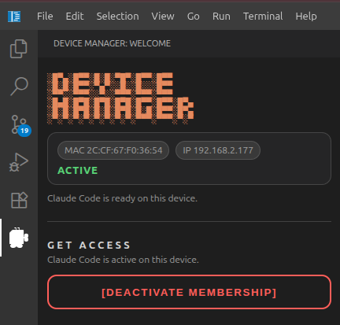
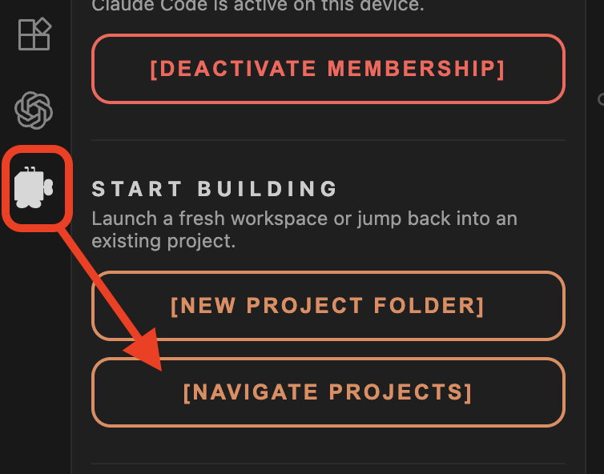

# Distiller Quickstart Guide

This page walks you through connecting Claude, Cursor, and OpenAI Codex to your Distiller device, then points you to ESP32 tutorials and minimal SDK examples.

> ⚠️ **Privacy Notice (Claude Free Trial):**  
> Our complimentary Claude Code subscription routes requests through our account, which means your prompts may be visible to us. You can disable the proxy at any time in **Settings**.

>💡 **Disclaimer**: You’re receiving an early beta version of the device. You will encounter bugs, and we are actively patching them. We’re a very small team (just 3 people), so if you can help by reporting bugs, sharing videos, etc., please reach out on Discord: https://discord.gg/NbJJFds7Rf or email us at founders@pamir.ai 

## Distiller Watchdog ✨ **NEW**

Your device now includes a self-healing diagnostic tool. Access it at:
`{your-device-name}.devices.pamir.ai/watchdog`

**Features:**
- **Help Me Debug**: Click this button to spin up a specialized agent that diagnoses and fixes issues automatically
- **System Info**: View disk usage, broken packages, and other diagnostic data
- **Quick Repairs**: Approve one-click fixes for common problems

> 💡 For best results, try the debug agent first. If issues persist, reach out to us on Discord or email.

## Secure Local Network Access (HTTPS)

Access your device securely over your local network by installing a self-signed certificate.

**Setup URL:**
`{your-device-name}.devices.pamir.ai/distiller/https`
or
`{device-ip}:3000/distiller/https/`

> Note: This feature only works on your local network using the device IP shown on screen.

## Change Your Password

You can change the default password from the login screen. Your password is securely hashed and stored locally on the device—never transmitted externally.

---

## 1) Connect AI IDE Services

### Claude (Claude Code CLI)

The device comes with a Claude account activated (lasts until we can’t afford it). You can toggle our Claude account on/off in Settings.
   

> If you want to use the Claude Code VS Code extension, you’ll need to sign in with your own account.

---

## 2) ESP32 Tutorials

To start with something fun ! 
Navigate to the sample project 

once you are in the project window, 
run in terminal 


```bash
claude
``` 

Example prompt to use:
> **create a cool rainbow 8x8 animation on my esp32, and upload it for me**

> It might ask for you help downloading stuff, help it, first time building the project might take longer time due to initialization and tool preparation.

> 

**Board features:** 8×8 LED matrix, IMU, BLE, Wi-Fi.
Claude should generate code, install toolchains, and flash the ESP32-S3. It will ask for manual steps only when needed.

---

## 3) Built-in Claude Skills

Your device comes with Claude Code skills pre-installed that can control hardware peripherals directly. Just ask Claude what skills are available and what it can do!

Examples:
- "What skills do you have?"
- "Play a sound on the speaker"
- "Update the e-ink display"

## 4) Network Settings
visit http://YOUR_DEVICE_IP:8080/ to update any network related changes

---
