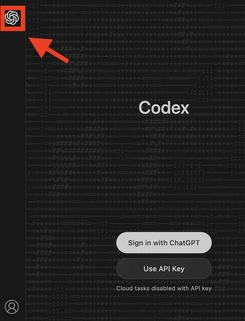
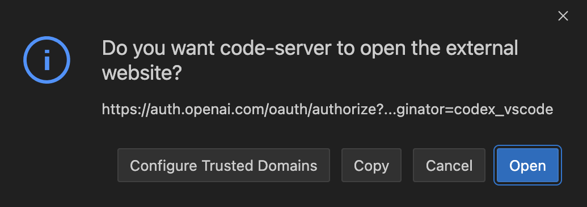
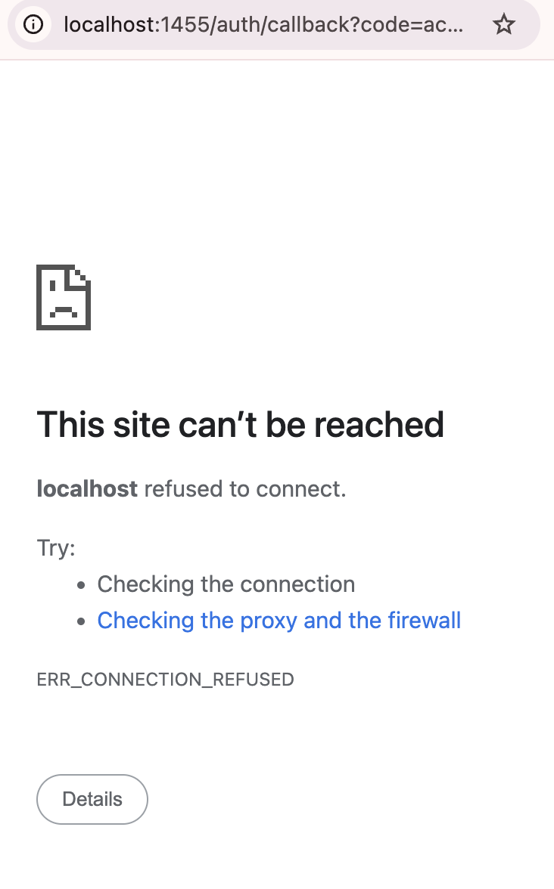
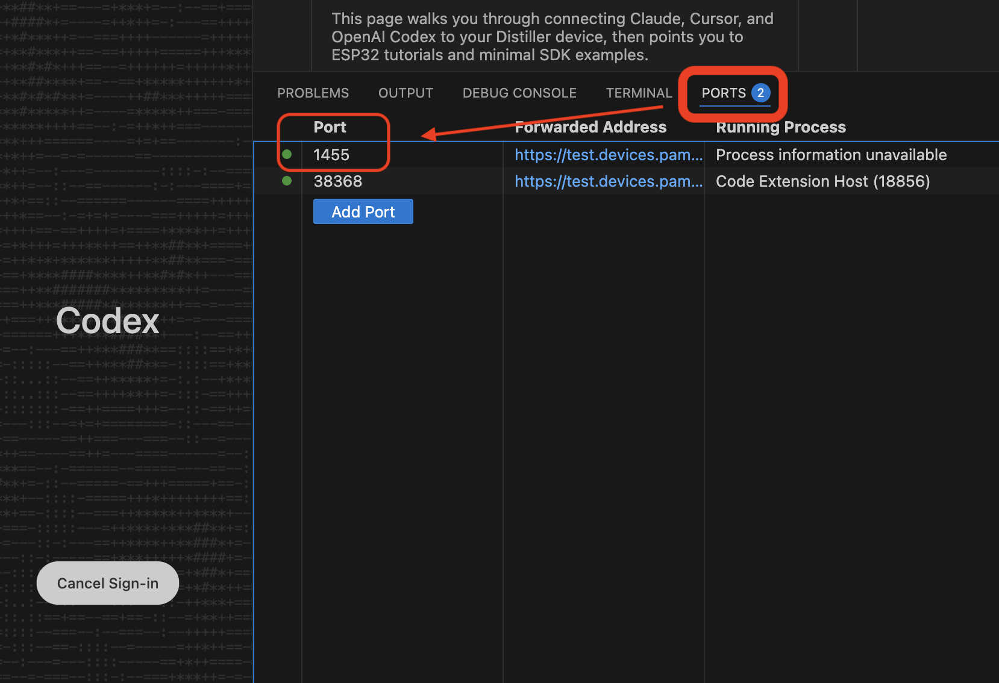
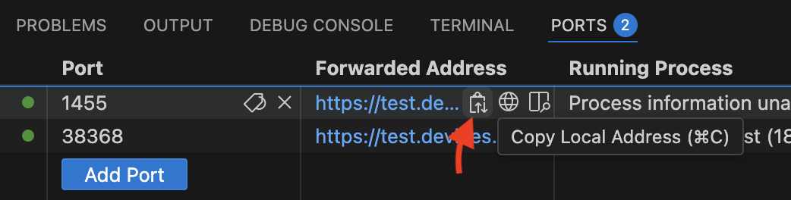

# Distiller CM5 Quickstart Guide

Welcome to your Distiller development journey! This guide will help you connect AI IDE services, explore hardware tutorials, and start building with the Distiller CM5 SDK.

---

> **Privacy Notice - Claude Free Trial**
> Our complimentary Claude Code subscription routes requests through our account, which means your prompts may be visible to us. You can disable the proxy anytime in **Settings**.

> **Early Beta Notice**
> You're running an early beta version of the device. Bugs are expected and we're actively fixing them. We're a small team (just 3 people!), so your feedback is invaluable. Join us on [Discord](https://discord.gg/NbJJFds7Rf) or email [founders@pamir.ai](mailto:founders@pamir.ai)

---

## Security Setup

### Change the Default Password

**Important:** Secure your device by changing the default password.

<a data-cmd="pamir.openPasswordConfig" href="#">Click here to open password config</a>

Update the password in `/opt/claude-code-web-manager/config/production.json`, save the file, and reboot for changes to take effect.

---

## Enable HTTPS over Local Network

To enable secure HTTPS access using your device's local IP address (displayed on the e-ink screen):

1. Visit `https://<device-accesspoint>/distiller/https/` (e.g., `https://example.devices.pamir.ai/distiller/https/`)
2. The page will automatically detect your OS and guide you through installing the self-signed certificate
3. Once installed, you can securely access your device via HTTPS using its local network IP

> **Note:** This feature only works when connected to the same local network as your device for security reasons.

---

## New Extensions & Examples

Your device includes helpful development tools and example agents:

### Extensions
- **Distiller Port Manager** - Automatically discover and manage development server ports
- **Distiller Messaging** - Integrate Slack webhooks for device notifications

### Example Agents
Explore pre-built agent examples: **personal-dashboard** and **git-glowUp-agent**

Access these via the **Session Manager** extension's "Navigate Projects" button.

---

## AI IDE Services Setup

### Claude Code CLI

The device includes a pre-activated Claude account for your convenience. Toggle the Claude proxy in **Settings** as needed.


> **Note:** To use the Claude Code VS Code extension, sign in with your own Claude account.

---

### OpenAI Codex Extension

**Setup Required:** You'll need your own OpenAI account to use Codex.

The device doesn’t include an OpenAI account, so you’ll need to sign in with your own.

For extension or CLI theres a login known issue: [https://github.com/openai/codex/issues/2798](https://github.com/openai/codex/issues/2798)

**Login Steps with Port Forwarding:**

1. Click on the **Codex Icon** in VS Code sidebar
   

2. Click **Sign in with ChatGPT** and follow the login flow
   

3. After login, you'll see a **"This site can't be reached"** error - this is expected
   

4. In VS Code, navigate to the **PORTS** tab. Look for port **1455** (if missing, add it manually)
   

5. Copy the **forwarded address** using the copy icon
   

6. Return to the error page and replace `http://localhost:1455/` with your copied forwarded address

7. The page will redirect to `http://localhost:1455/success/*` - replace `http://localhost:1455` again with the forwarded address

   
   

**You're all set!**

---

### Cursor Agent

Cursor Agent is optional; you can try it and tell us what you’d like automated:

```bash
cursor-agent
```

---

## ESP32 Hardware Tutorials

Ready for some hands-on fun? Let's create something with your ESP32 board!

### Getting Started

1. Navigate to the sample project in VS Code
   

2. Open a terminal and run:
   ```bash
   claude
   ```

3. Try this example prompt:
   > **"Create a rainbow 8x8 LED animation on my ESP32 and upload it"**

> **Note:** Claude may request your assistance for downloading dependencies. The first build may take longer due to toolchain initialization.

### Board Capabilities
- **8×8 LED Matrix** - Create animations and visualizations
- **IMU Sensor** - Motion and orientation detection
- **BLE & Wi-Fi** - Wireless connectivity
- **ESP32-S3** - Powerful dual-core processor

Claude will generate code, configure toolchains, and flash the board - asking for manual intervention only when necessary.

---

## SDK & Code Examples

Explore the full SDK capabilities with these minimal examples. Complete documentation: `/opt/distiller-cm5-sdk/README.md`

### Environment Setup

**Option 1: Configure your shell environment**

```bash
export PYTHONPATH="/opt/distiller-cm5-sdk:${PYTHONPATH}"
export LD_LIBRARY_PATH="/opt/distiller-cm5-sdk/lib:${LD_LIBRARY_PATH}"
source /opt/distiller-cm5-sdk/.venv/bin/activate
```

**Option 2: Use Python directly**

```bash
/opt/distiller-cm5-sdk/.venv/bin/python
```

---

### E-ink Display

Display images with automatic scaling and dithering:

```python
from distiller_cm5_sdk.hardware.eink import Display, DisplayMode

with Display() as d:
    d.display_png_auto("/path/to/image.png", DisplayMode.FULL)
```

---

### Camera

Capture images from the CSI camera module:

```python
from distiller_cm5_sdk.hardware.camera import Camera

cam = Camera()
cam.capture_image("/tmp/photo.jpg")
cam.close()
```

---

### Audio

Record and playback audio:

```python
from distiller_cm5_sdk.hardware.audio import Audio

a = Audio()
a.record("/tmp/out.wav", duration=3.0)
a.stop_recording()
a.play("/tmp/out.wav")
a.close()
```

---

### Parakeet ASR (Speech Recognition)

Real-time speech-to-text with push-to-talk:

```python
from distiller_cm5_sdk.parakeet import Parakeet

asr = Parakeet()
try:
    for text in asr.record_and_transcribe_ptt():
        print(text)
finally:
    asr.cleanup()
```

---

### Piper TTS (Text-to-Speech)

Stream synthesized speech to speakers:

```python
from distiller_cm5_sdk.piper import Piper

Piper().speak_stream("Hello from Distiller!", volume=50)
```

---

## Network Configuration

Manage Wi-Fi, hostname, and other network settings through the web interface:

**Access:** `http://YOUR_DEVICE_IP:8080/`

---

**Need Help?** Join our [Discord community](https://discord.gg/NbJJFds7Rf) or email [founders@pamir.ai](mailto:founders@pamir.ai)
