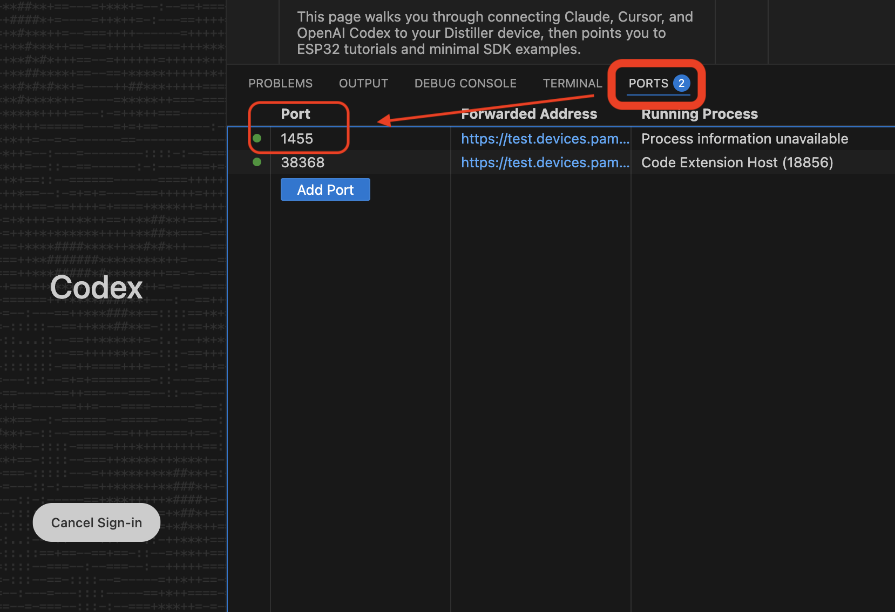

# Distiller Quickstart Guide

This page walks you through connecting Claude, Cursor, and OpenAI Codex to your Distiller device, then points you to ESP32 tutorials and minimal SDK examples.

> ⚠️ **Privacy Notice (Claude Free Trial):**  
> Our complimentary Claude Code subscription routes requests through our account, which means your prompts may be visible to us. You can disable the proxy at any time in **Settings**.

>💡 **Disclaimer**: You’re receiving an early beta version of the device. You will encounter bugs, and we are actively patching them. We’re a very small team (just 3 people), so if you can help by reporting bugs, sharing videos, etc., please reach out on Discord: https://discord.gg/NbJJFds7Rf or email us at founders@pamir.ai 

## Change the Default Password

Click <a data-cmd="pamir.openPasswordConfig" href="#">here</a> to open /opt/claude-code-web-manager/config/production.json directly in VS Code. Update the password value, press save, and your changes will apply the next time you boot the device.

---

## 1) Connect AI IDE Services

### Claude (Claude Code CLI)

The device comes with a Claude account activated (lasts until we can’t afford it). You can toggle our Claude account on/off in Settings.
   

> If you want to use the Claude Code VS Code extension, you’ll need to sign in with your own account.

---

### OpenAI Codex Extension

The device doesn’t include an OpenAI account, so you’ll need to sign in with your own.

For extension or CLI theres a login known issue: [https://github.com/openai/codex/issues/2798](https://github.com/openai/codex/issues/2798)

**Login via Distiller Web UI with port forwarding**
1. Click on the Codex Icon 
2. Click **Sign in with ChatGPT**.
3. Follow the pop-up window to login 
4. You’ll land on a **“This site can’t be reached”** page after login. This is expected. 
5. Go back to your VS Code page, click **PORTS**, and you should see port **1455**. (If you don’t, click **Add Port**, enter **1455**, then press **Enter**.) 
6. Click the tiny copy icon to copy the **forwarded address**.  
7. Return to the **“This site can’t be reached”** Codex login page. Replace http://localhost:1455/ with the copied **forwarded address**, hit **Enter**. It will redirects to http://localhost:1455/success/*, replace the same http://localhost:1455 part with the **forwarded address** again and hit Enter. 

> 
> 
You should be good to go!

---

### Cursor Agent

Cursor Agent is optional; you can try it and tell us what you’d like automated:

```bash
cursor-agent
```

---

## 2) ESP32 Tutorials

To start with some fun ! 
Navigate to the sample project 

once you are in the project window, 
run in terminal 


```bash
claude
``` 

Example prompt to use:
> **create a cool rainbow 8x8 animation on my esp32, and upload it for me**

> It might ask for you help downloading stuff, help it, first time building the project might take longer time due to initialization and tool preparation.

> 

**Board features:** 8×8 LED matrix, IMU, BLE, Wi-Fi.
Claude should generate code, install toolchains, and flash the ESP32-S3. It will ask for manual steps only when needed.

---

## 3) SDK & Minimal Examples

For full docs, see: `/opt/distiller-cm5-sdk/README.md`

### Environment Setup

```bash
# One-time per shell
export PYTHONPATH="/opt/distiller-cm5-sdk:${PYTHONPATH}"
export LD_LIBRARY_PATH="/opt/distiller-cm5-sdk/lib:${LD_LIBRARY_PATH}"
source /opt/distiller-cm5-sdk/.venv/bin/activate
```

Or call Python directly:

```bash
/opt/distiller-cm5-sdk/.venv/bin/python
```

### E-ink (auto-scale + dither)

```python
from distiller_cm5_sdk.hardware.eink import Display, DisplayMode

with Display() as d:
    d.display_png_auto("/path/to/image.png", DisplayMode.FULL)
```

### Camera (capture to file)

```python
from distiller_cm5_sdk.hardware.camera import Camera

cam = Camera()
cam.capture_image("/tmp/photo.jpg")
cam.close()
```

### Audio (record 3s, then play)

```python
from distiller_cm5_sdk.hardware.audio import Audio

a = Audio()
a.record("/tmp/out.wav", duration=3.0)
a.stop_recording()
a.play("/tmp/out.wav")
a.close()
```

### Parakeet ASR (push-to-talk loop)

```python
from distiller_cm5_sdk.parakeet import Parakeet

asr = Parakeet()
try:
    for text in asr.record_and_transcribe_ptt():
        print(text)
finally:
    asr.cleanup()
```

### Piper TTS (stream to speakers)

```python
from distiller_cm5_sdk.piper import Piper

Piper().speak_stream("Hello from Distiller!", volume=50)
```

## 4) Network Settings
visit http://YOUR_DEVICE_IP:8080/ to update any network related changes

---
